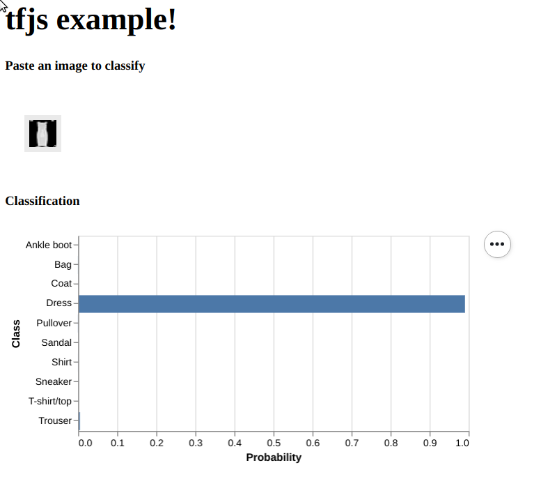

# Run a pre-trained model in tfjs; fashion mnist example

- [Colab Link](https://colab.research.google.com/drive/1vuyXzZH0_xazSh_kg6btD2QR4Kv0n8Of)

### Running

`python3 -m http.server 8004`

### Usage

Open a browser to <localhost:8004> then paste in an image from
[here](https://raw.githubusercontent.com/zalandoresearch/fashion-mnist/master/doc/img/fashion-mnist-sprite.png).
